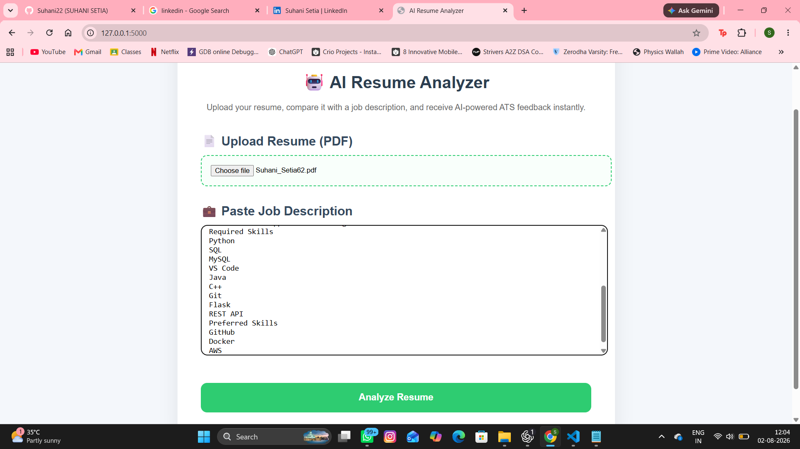
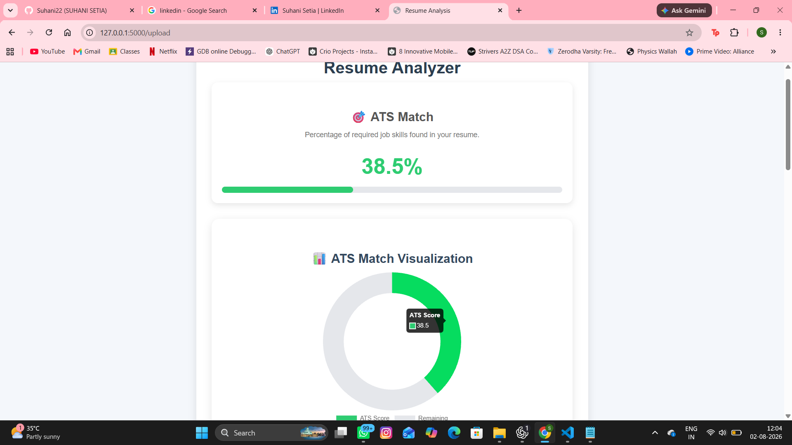
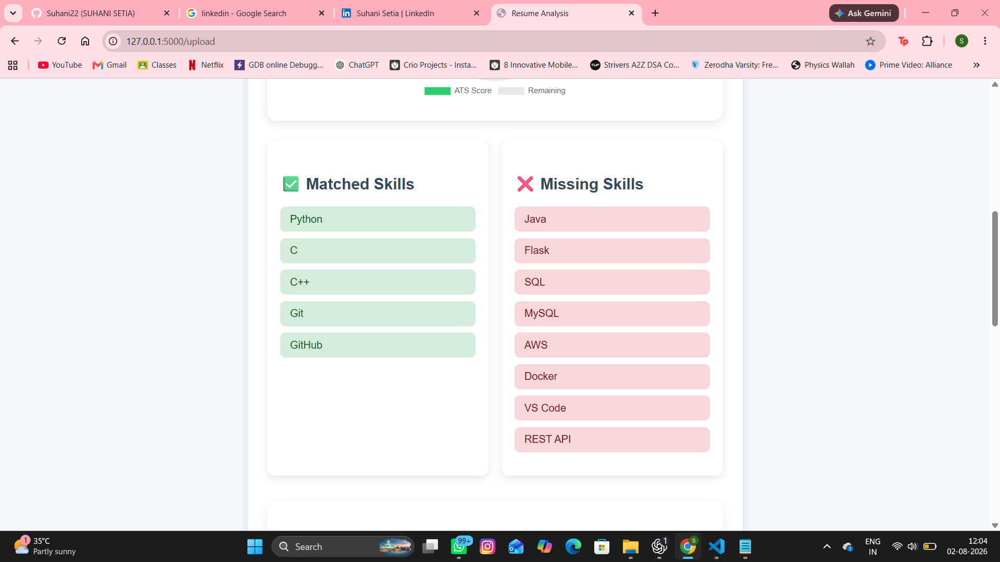
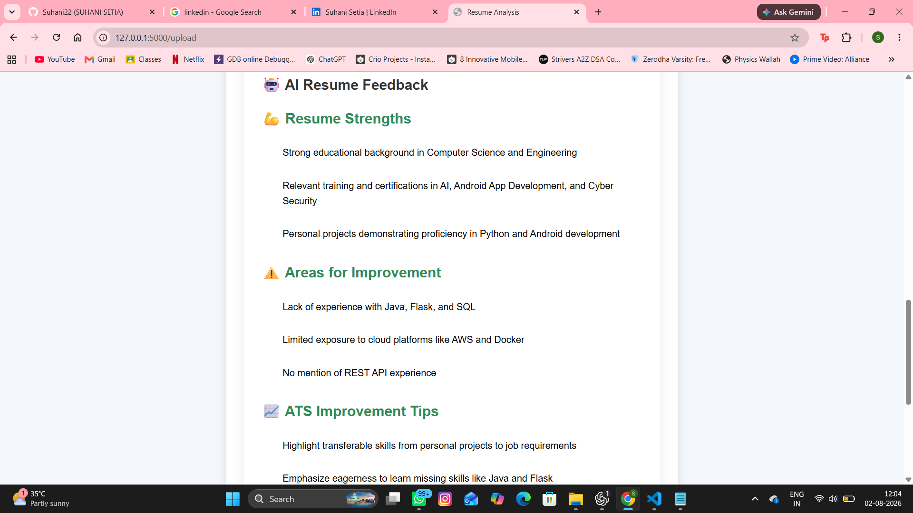
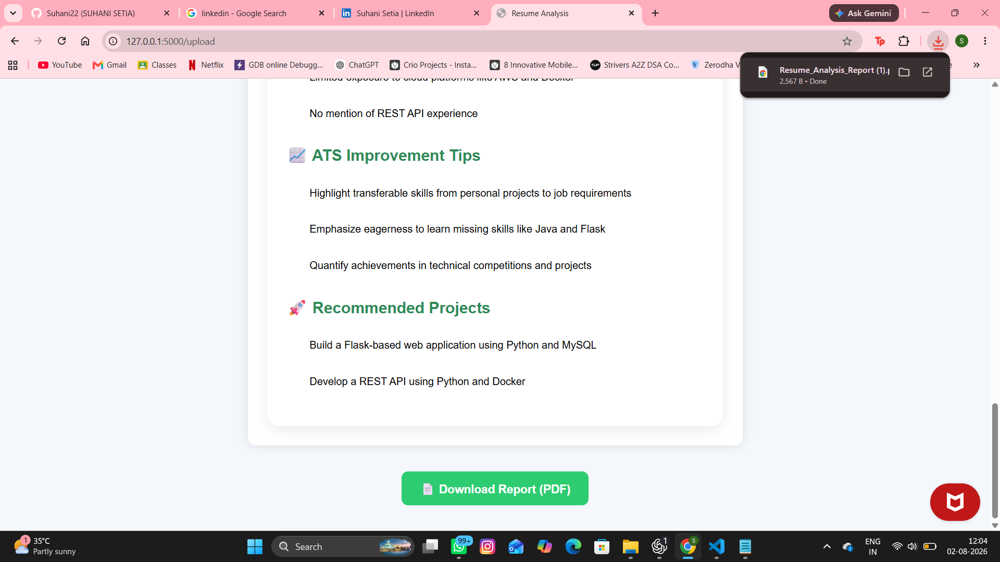

# 🤖 AI Resume Analyzer

An AI-powered Resume Analyzer that compares a resume against a Job Description, extracts relevant skills, calculates Job Match, identifies missing skills, generates personalized AI feedback using Groq LLM, and allows users to download a professional PDF report.

---

## 🚀 Features

- 📄 Upload Resume (PDF)
- 💼 Paste any Job Description
- 🔍 Automatic Skill Extraction
- ✅ Matching Skills Detection
- ❌ Missing Skills Detection
- 📊 Job Match Percentage
- 🤖 AI Resume Feedback using Groq LLM
- 📈 ATS-style Doughnut Chart
- 📥 Download Analysis Report as PDF

---

## 🛠 Tech Stack

- Python
- Flask
- HTML
- CSS
- Chart.js
- Groq API (Llama 3.3 70B)
- ReportLab
- Markdown

---

## 📂 Project Structure

```
AI Resume Analyzer/
│
├── app.py
├── requirements.txt
├── README.md
│
├── static/
│   └── style.css
│
├── templates/
│   ├── index.html
│   └── results.html
│
├── uploads/
│
└── utils/
    ├── pdf_reader.py
    ├── skill_extractor.py
    ├── job_matcher.py
    ├── suggestions.py
    └── pdf_generator.py
```

---

## ⚙ Installation

Clone the repository

```bash
git clone https://github.com/Suhani22/AI-Resume-Analyzer.git
```

Move into the project

```bash
cd AI-Resume-Analyzer
```

Create virtual environment

```bash
python -m venv venv
```

Activate virtual environment

Windows

```bash
venv\Scripts\activate
```

Install dependencies

```bash
pip install -r requirements.txt
```

Create a `.env` file

```env
GROQ_API_KEY=your_api_key_here
```

Run the application

```bash
python app.py
```

Open

```
http://127.0.0.1:5000
```

---

## 📸 Screenshots

### Home Page

Upload your resume and paste a Job Description.



---


### Analysis Dashboard

View Job Match percentage, ATS chart, matching skills and missing skills.



### 🤖 AI Resume Feedback

Receive personalized AI-generated suggestions to improve your resume.



### PDF Report




---

## 📊 How It Works

1. Upload Resume (PDF)
2. Paste Job Description
3. Resume text is extracted.
4. Skills are extracted from both Resume and Job Description.
5. Matching and Missing skills are identified.
6. Job Match percentage is calculated.
7. Groq AI generates personalized resume feedback.
8. A downloadable PDF report is created.

---

## 📌 Future Improvements

- Semantic Skill Extraction using Sentence Transformers
- ATS Score based on multiple parameters
- Resume Grammar Analysis
- Resume Keyword Suggestions
- AI Interview Question Generator
- Resume Ranking against Multiple Job Descriptions

---

## 👩‍💻 Author

**Suhani Setia**

GitHub: [Suhani22] https://github.com/Suhani22

LinkedIn:[Suhani Setia](https://www.linkedin.com/in/suhani-setia-9a45b720b/)

---

